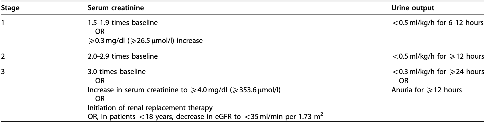

[](https://coveralls.io/github/aidh-ms/pyAKI?branch=main)

# pyAKI

Python package to detect AKI within time series data.

The goal of this package is to establish well tested, comprehensive functions for the detection of Acute Kidney Injury (AKI) in time series data, according to the Kidney Disease Improving Global Outcomes (KDIGO) Criteria, established in 2012 [^kdigo].


## Installation

You can install the pyAKI package from PyPI or from source.

Frm PyPI:
```shell
pip install pyAKI
```

From source:
```shell
pip install git+https://github.com/aidh-ms/pyAKI
```

## Usage

```python
import pandas as pd

from pyaki.probes import Dataset, DatasetType
from pyaki.kdigo import Analyser

data = [
    Dataset(DatasetType.URINEOUTPUT, pd.DataFrame()),
    Dataset(DatasetType.CREATININE, pd.DataFrame()),
    Dataset(DatasetType.DEMOGRAPHICS, pd.DataFrame()),
    Dataset(DatasetType.RRT, pd.DataFrame()),
]

analyser = Analyser(data)
results: pd.Dataframe =  analyser.process_stays()
```

## Contributing

### Getting Started

> [!NOTE]
> Use the included dev container to automatically install all the necessary dev tools and dependencies. To use this you first need to install docker under Linux or WSL2 under windows.

1. **Clone the repository:**
    ```bash
    git clone git+https://github.com/aidh-ms/pyAKI
    cd pyAKI
    ```

2. **Open the project in Visual Studio Code:**
    ```bash
    code .
    ```

3. **Reopen in Container:**
    - Press `F1` to open the command palette.
    - Type `Remote-Containers: Reopen in Container` and select it.
    - VS Code will build the Docker container defined in the `.devcontainer` folder and open the project inside the container.

### Tests

To test your contribution, you can use the testing tap in the VS code or utilise the following command to run the unit tests for this project:

```shell
poetry run pytest .
```

## Acknowledgement

We encourage all users to use pyAKI in their scientific work. Doing so, please use the following citation. Our paper can be found on [PLOS One](https://journals.plos.org/plosone/article?id=10.1371/journal.pone.0315325).
```
@article{10.1371/journal.pone.0315325,
    doi = {10.1371/journal.pone.0315325},
    author = {Porschen, Christian AND Ernsting, Jan AND Brauckmann, Paul AND Weiss, Raphael AND Würdemann, Till AND Booke, Hendrik AND Amini, Wida AND Maidowski, Ludwig AND Risse, Benjamin AND Hahn, Tim AND von Groote, Thilo},
    journal = {PLOS ONE},
    publisher = {Public Library of Science},
    title = {pyAKI—An open source solution to automated acute kidney injury classification},
    year = {2025},
    month = {01},
    volume = {20},
    url = {https://doi.org/10.1371/journal.pone.0315325},
    pages = {1-14},
    abstract = {Objective Acute kidney injury (AKI) is a frequent complication in critically ill patients, affecting up to 50% of patients in the intensive care units. The lack of standardized and open-source tools for applying the Kidney Disease Improving Global Outcomes (KDIGO) criteria to time series, requires researchers to implement classification algorithms of their own which is resource intensive and might impact study quality by introducing different interpretations of edge cases. This project introduces pyAKI, an open-source pipeline addressing this gap by providing a comprehensive solution for consistent KDIGO criteria implementation.   Materials and methods The pyAKI pipeline was developed and validated using a subset of the Medical Information Mart for Intensive Care (MIMIC)-IV database, a commonly used database in critical care research. We constructed a standardized data model in order to ensure reproducibility. PyAKI implements the Kidney Disease: Improving Global Outcomes (KDIGO) guideline on AKI diagnosis. After implementation of the diagnostic algorithm, using both serum creatinine and urinary output data, pyAKI was tested on a subset of patients and diagnostic accuracy was compared in a comparative analysis against annotations by physicians.   Results Validation against expert annotations demonstrated pyAKI’s robust performance in implementing KDIGO criteria. Comparative analysis revealed its ability to surpass the quality of human labels with an accuracy of 1.0 in all categories.   Discussion The pyAKI pipeline is the first open-source solution for implementing KDIGO criteria in time series data. It provides a standardized data model and a comprehensive solution for consistent AKI classification in research applications for clinicians and data scientists working with AKI data. The pipeline’s high accuracy make it a valuable tool for clinical research and decision support systems.   Conclusion This work introduces pyAKI as an open-source solution for implementing the KDIGO criteria for AKI diagnosis using time series data with high accuracy and performance.},
    number = {1},

}
```

[^kdigo]: Improving Global Outcomes (KDIGO) Acute Kidney Injury Work Group. KDIGO Clinical Practice Guideline for Acute Kidney Injury. Kidney inter., Suppl. 2012; 2: 1–138.
