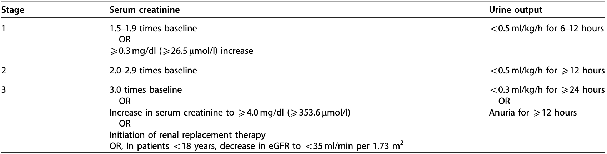

# Package overview

Python package to detect AKI within time series data.

The goal of this package is to establish well tested, comprehensive functions for the detection of Acute Kidney Injury (AKI) in time series data, according to the Kidney Disease Improving Global Outcomes (KDIGO) Criteria, established in 2012 [^kdigo].


# License

```
MIT License

Copyright (c) 2023 AIDH MS

Permission is hereby granted, free of charge, to any person obtaining a copy
of this software and associated documentation files (the "Software"), to deal
in the Software without restriction, including without limitation the rights
to use, copy, modify, merge, publish, distribute, sublicense, and/or sell
copies of the Software, and to permit persons to whom the Software is
furnished to do so, subject to the following conditions:

The above copyright notice and this permission notice shall be included in all
copies or substantial portions of the Software.

THE SOFTWARE IS PROVIDED "AS IS", WITHOUT WARRANTY OF ANY KIND, EXPRESS OR
IMPLIED, INCLUDING BUT NOT LIMITED TO THE WARRANTIES OF MERCHANTABILITY,
FITNESS FOR A PARTICULAR PURPOSE AND NONINFRINGEMENT. IN NO EVENT SHALL THE
AUTHORS OR COPYRIGHT HOLDERS BE LIABLE FOR ANY CLAIM, DAMAGES OR OTHER
LIABILITY, WHETHER IN AN ACTION OF CONTRACT, TORT OR OTHERWISE, ARISING FROM,
OUT OF OR IN CONNECTION WITH THE SOFTWARE OR THE USE OR OTHER DEALINGS IN THE
SOFTWARE.
```

[^kdigo]: Improving Global Outcomes (KDIGO) Acute Kidney Injury Work Group. KDIGO Clinical Practice Guideline for Acute Kidney Injury. Kidney inter., Suppl. 2012; 2: 1–138.
