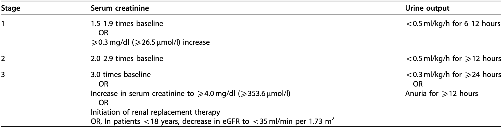

# pyAKI

_A Python package to detect AKI within time series data._  

---

**Source Code:** [https://github.com/aidh-ms/pyAKI](https://github.com/aidh-ms/pyAKI)
**Paper:** [https://doi.org/10.1371/journal.pone.0315325](https://doi.org/10.1371/journal.pone.0315325)

---

The goal of this package is to establish well tested, comprehensive functions for the detection of Acute Kidney Injury (AKI) in time series data, according to the Kidney Disease Improving Global Outcomes (KDIGO) Criteria, established in 2012 [^kdigo].

[^kdigo]: Improving Global Outcomes (KDIGO) Acute Kidney Injury Work Group. KDIGO Clinical Practice Guideline for Acute Kidney Injury. Kidney inter., Suppl. 2012; 2: 1–138.
