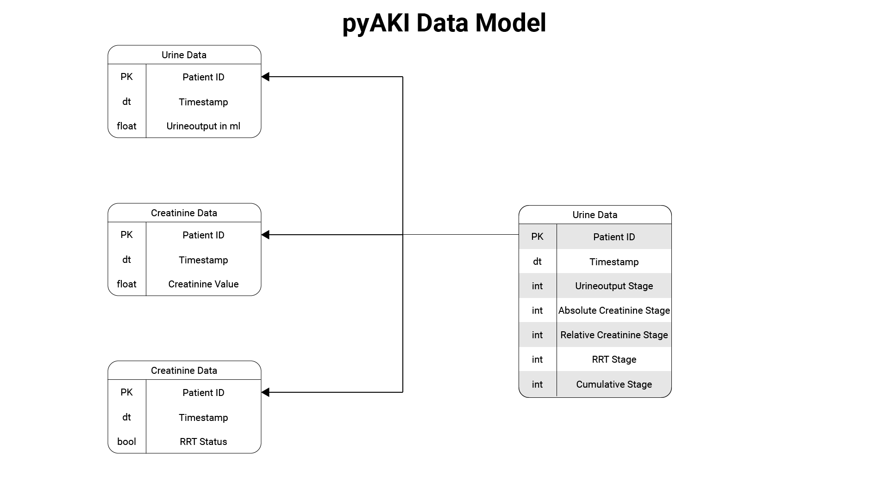

# Input Data

pyAKI defines a common data model for the input data. This data model is depicted below:

The input data should contain at least the following columns:

- `stay_id`: A unique ID of the patient stay, the default is `stay_id`.
- `timestamp`: The timestamp of the measurement, the default is `charttime`.
- `value`: The value of the measurement, the default is specific to the dataframe, for urine data it's `urineoutput`, for creatinine it's `creat`, for renal replacment therapy data it's `rrt_status`.

## Urine Data
